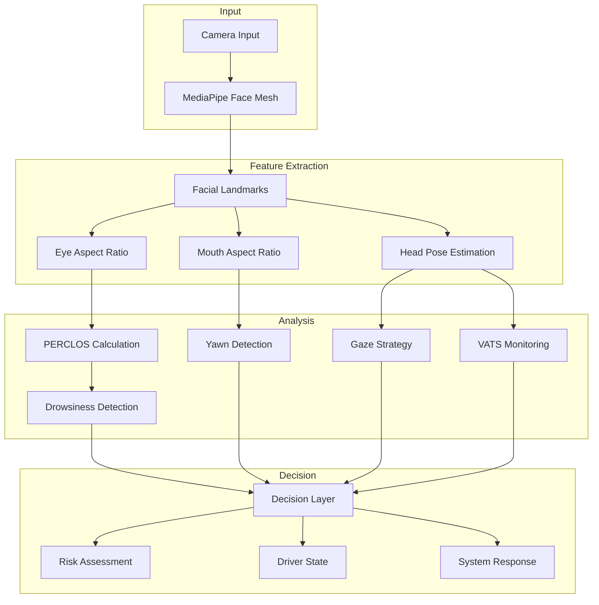
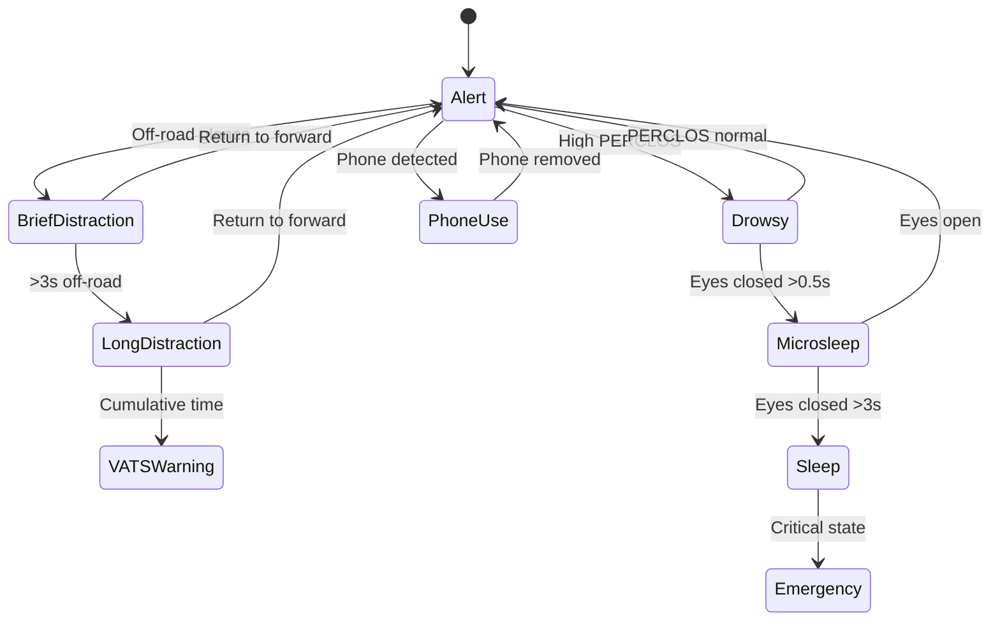
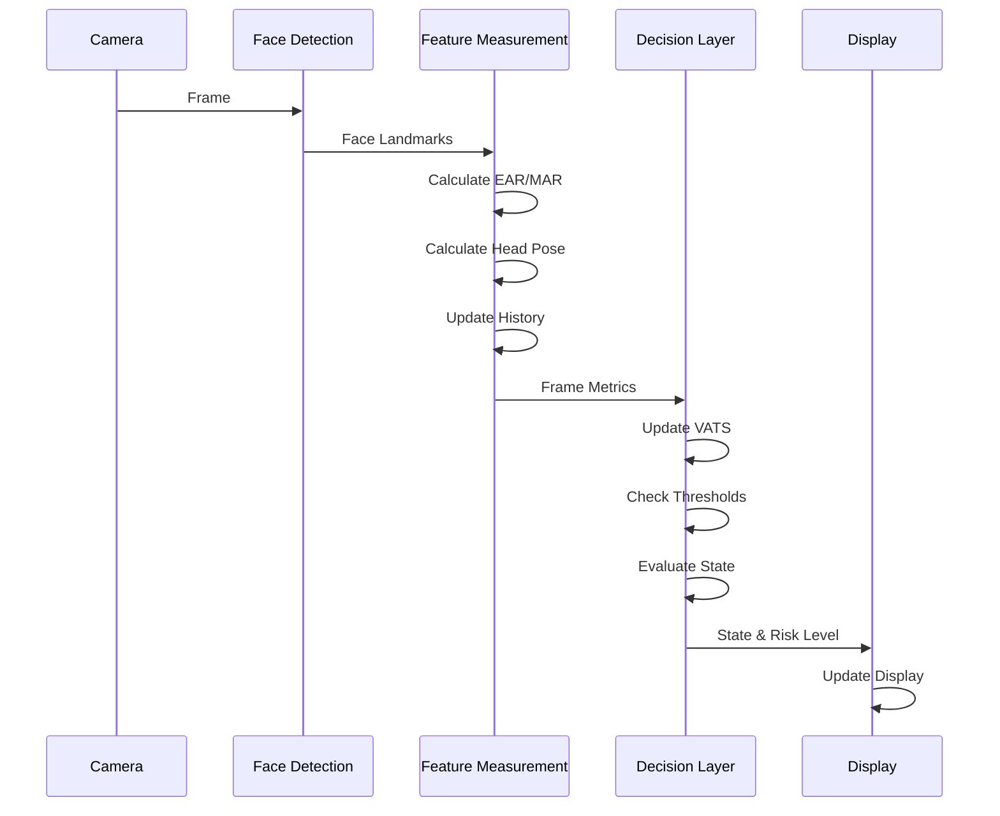
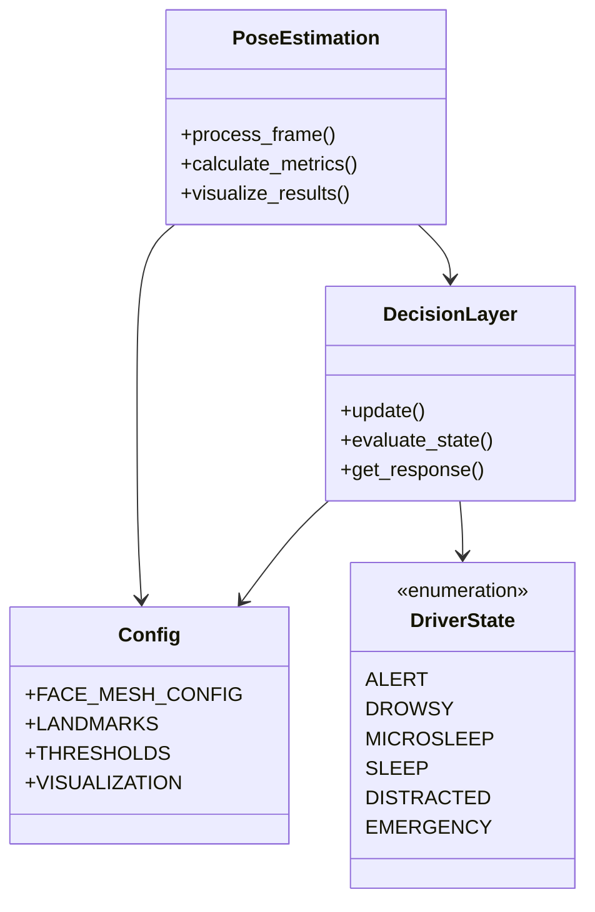
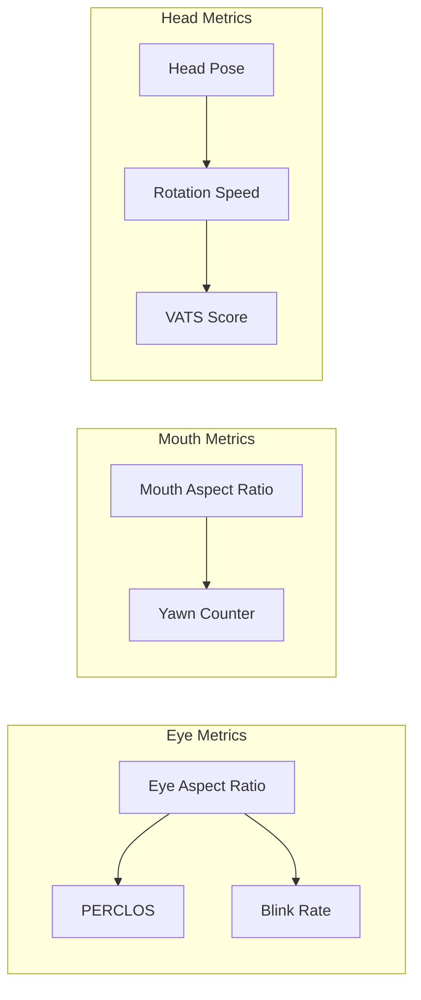

Driver Monitoring System Documentation

## System Architecture

```mermaid
flowchart TB
    subgraph Input
        CAM[Camera Input]
        MP[MediaPipe Face Mesh]
    end
    
    subgraph Feature Extraction
        LANDMARKS[Facial Landmarks]
        EAR[Eye Aspect Ratio]
        MAR[Mouth Aspect Ratio]
        HEAD[Head Pose Estimation]
    end
    
    subgraph Analysis
        PERCLOS[PERCLOS Calculation]
        DROWSY[Drowsiness Detection]
        YAWN[Yawn Detection]
        GAZE[Gaze Strategy]
        VATS[VATS Monitoring]
    end
    
    subgraph Decision
        DL[Decision Layer]
        RISK[Risk Assessment]
        STATE[Driver State]
        RESPONSE[System Response]
    end

    CAM --> MP
    MP --> LANDMARKS
    LANDMARKS --> EAR & MAR & HEAD
    EAR --> PERCLOS --> DROWSY
    MAR --> YAWN
    HEAD --> GAZE & VATS
    DROWSY & YAWN & GAZE & VATS --> DL
    DL --> RISK & STATE & RESPONSE
```

## State Machine

```mermaid
stateDiagram-v2
    [*] --> Alert
    Alert --> BriefDistraction: Off-road glance
    Alert --> Drowsy: High PERCLOS
    Alert --> PhoneUse: Phone detected
    
    BriefDistraction --> LongDistraction: >3s off-road
    BriefDistraction --> Alert: Return to forward
    
    LongDistraction --> VATSWarning: Cumulative time
    LongDistraction --> Alert: Return to forward
    
    Drowsy --> Microsleep: Eyes closed >0.5s
    Drowsy --> Alert: PERCLOS normal
    
    Microsleep --> Sleep: Eyes closed >3s
    Microsleep --> Alert: Eyes open
    
    Sleep --> Emergency: Critical state
    
    PhoneUse --> Alert: Phone removed
```

## Processing Pipeline

```mermaid
sequenceDiagram
    participant C as Camera
    participant FD as Face Detection
    participant FM as Feature Measurement
    participant DL as Decision Layer
    participant UI as Display

    C->>FD: Frame
    FD->>FM: Face Landmarks
    FM->>FM: Calculate EAR/MAR
    FM->>FM: Calculate Head Pose
    FM->>FM: Update History
    FM->>DL: Frame Metrics
    DL->>DL: Update VATS
    DL->>DL: Check Thresholds
    DL->>DL: Evaluate State
    DL->>UI: State & Risk Level
    UI->>UI: Update Display
```

## Component Interactions

```mermaid
classDiagram
    class Config {
        +FACE_MESH_CONFIG
        +LANDMARKS
        +THRESHOLDS
        +VISUALIZATION
    }
    
    class PoseEstimation {
        +process_frame()
        +calculate_metrics()
        +visualize_results()
    }
    
    class DecisionLayer {
        +update()
        +evaluate_state()
        +get_response()
    }
    
    class DriverState {
        <<enumeration>>
        ALERT
        DROWSY
        MICROSLEEP
        SLEEP
        DISTRACTED
        EMERGENCY
    }
    
    PoseEstimation --> Config
    PoseEstimation --> DecisionLayer
    DecisionLayer --> DriverState
    DecisionLayer --> Config
```

## Metrics Calculation

```mermaid
graph LR
    subgraph Eye Metrics
        EAR[Eye Aspect Ratio]
        PERCLOS[PERCLOS]
        BLINK[Blink Rate]
    end
    
    subgraph Mouth Metrics
        MAR[Mouth Aspect Ratio]
        YAWN[Yawn Counter]
    end
    
    subgraph Head Metrics
        POSE[Head Pose]
        ROT[Rotation Speed]
        VATS[VATS Score]
    end
    
    EAR --> PERCLOS
    EAR --> BLINK
    MAR --> YAWN
    POSE --> ROT
    ROT --> VATS
```